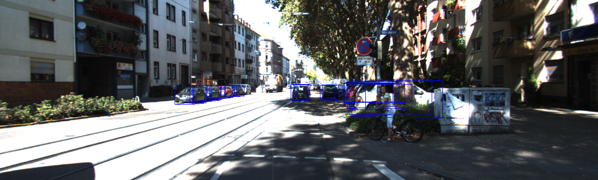
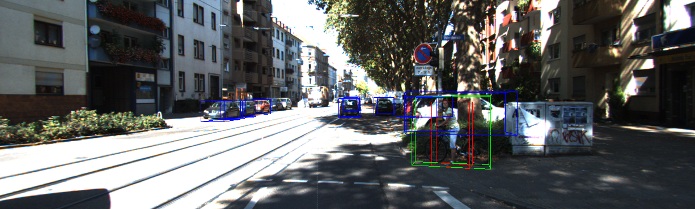
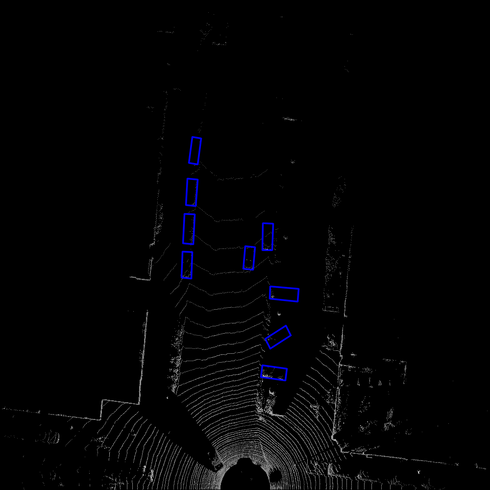
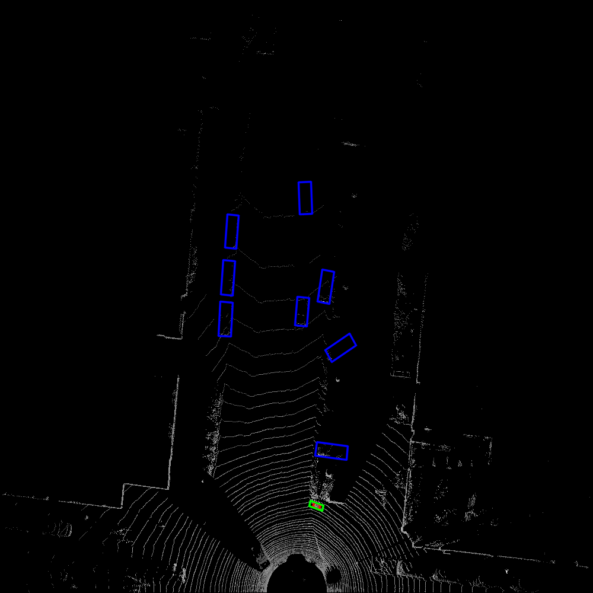

# Multimodal PointPillars for KITTI 3D Object Detection

This repository contains my work extending PointPillars for multimodal 3D object detection on the KITTI dataset. The project compares a LiDAR-only detector with a multimodal model that combines LiDAR pillars and camera image features.

The main goal of this work is to study whether image information improves detection quality on difficult KITTI scenes and individual validation frames.

## What I changed

- Added a multimodal PointPillars model using KITTI `image_2` data alongside LiDAR.
- Added multimodal training and evaluation options through `--multimodal`.
- Preserved the original LiDAR-only training and evaluation path for comparison.
- Added experiment-specific checkpoints, logs, and evaluation outputs.
- Added scripts for comparing LiDAR-only and multimodal predictions on individual samples.
- Ranked validation frames where multimodal predictions improve over the LiDAR-only model.

## Results

The following results are from the evaluation outputs in this repository. Values are reported as Easy, Moderate, and Hard, respectively.

| Metric | LiDAR-only | Multimodal |
| --- | ---: | ---: |
| 2D AP | 69.31 / 58.50 / 57.14 | **73.43 / 65.12 / 60.68** |
| BEV AP | 66.64 / 56.15 / 52.51 | **66.77 / 56.39 / 53.39** |
| 3D AP | **58.41 / 47.54 / 45.85** | 58.32 / **47.97** / 44.00 |
| AOS AP | 58.39 / 49.23 / 47.90 | **61.57 / 53.86 / 50.23** |

These aggregate metrics are complemented by frame-level analysis. The files under `comparison_results/` rank validation samples by true-positive gain, false-positive reduction, and F1 improvement.

## Qualitative comparison: sample 003855

The following KITTI validation sample compares the LiDAR-only prediction with the multimodal prediction. The multimodal model uses the same LiDAR scene together with camera features and produces a different set of image-aligned detections in the foreground.

| LiDAR-only | Multimodal |
| --- | --- |
|  |  |

The corresponding bird's-eye-view outputs are shown below:

| LiDAR-only BEV | Multimodal BEV |
| --- | --- |
|  |  |

This sample is included as a qualitative example; aggregate metrics and ranked frame comparisons are reported separately above and in `comparison_results/`.

## Repository highlights

| Path | Purpose |
| --- | --- |
| `train.py` | Train LiDAR-only or multimodal PointPillars |
| `evaluate.py` | Evaluate a checkpoint on KITTI |
| `test.py` | Run inference on individual samples |
| `compare_sample_results.py` | Compare predictions frame by frame |
| `rank_test_predictions.py` | Rank samples by multimodal improvement |
| `POINTPILLARS_RUN_README.md` | Detailed setup and experiment commands |
| `comparison_results/` | CSV comparisons and ranked examples |
| `outs/` | Training logs, summaries, and checkpoints |
| `results_*/` | Evaluation and submission outputs |
| `test_outputs/` | Selected qualitative comparison outputs |

## Setup

Prepare a KITTI object detection dataset with this structure:

```text
kitti/
  training/
    calib/
    image_2/
    label_2/
    velodyne/
  testing/
    calib/
    image_2/
    velodyne/
```

Install the dependencies and build the local operators:

```bash
pip install -r requirements.txt
python setup.py build_ext --inplace
pip install .
```

Preprocess the dataset:

```bash
python pre_process_kitti.py --data_root /path/to/kitti
```

## Run the experiments

Train the LiDAR-only baseline:

```bash
python train.py \
  --data_root /path/to/kitti \
  --saved_path pillar_logs_lidar
```

Train the multimodal model:

```bash
python train.py \
  --data_root /path/to/kitti \
  --saved_path pillar_logs_multimodal \
  --multimodal \
  --batch_size 2
```

Evaluate a LiDAR-only checkpoint:

```bash
python evaluate.py \
  --data_root /path/to/kitti \
  --ckpt pretrained/epoch_160.pth \
  --saved_path results_lidar_noaug
```

Evaluate a multimodal checkpoint:

```bash
python evaluate.py \
  --data_root /path/to/kitti \
  --ckpt pillar_logs_multimodal/checkpoints/epoch_160.pth \
  --saved_path results_mm_noaug \
  --multimodal
```

For complete environment notes, troubleshooting, and experiment details, see [POINTPILLARS_RUN_README.md](POINTPILLARS_RUN_README.md).

## Reproducibility notes

- Multimodal training reads camera images from KITTI `image_2`.
- The image branch resizes images to `384x1280` before feature extraction.
- Multimodal training uses geometry-aware LiDAR augmentation and samples image features using the original point coordinates.
- Multimodal training may require a smaller batch size because of the additional image branch.
- The generated KITTI dataset, checkpoints, and large prediction artifacts are not required to understand the source changes and may be excluded from a public GitHub upload when repository size is a concern.

## Acknowledgment

This work is based on the open-source PointPillars implementation by [zhulf0804](https://github.com/zhulf0804/PointPillars), which implements the method from [PointPillars: Fast Encoders for Object Detection from Point Clouds](https://arxiv.org/abs/1812.05784). The original project and its license remain acknowledged here; the multimodal extensions and experiment analysis in this repository are my work.
